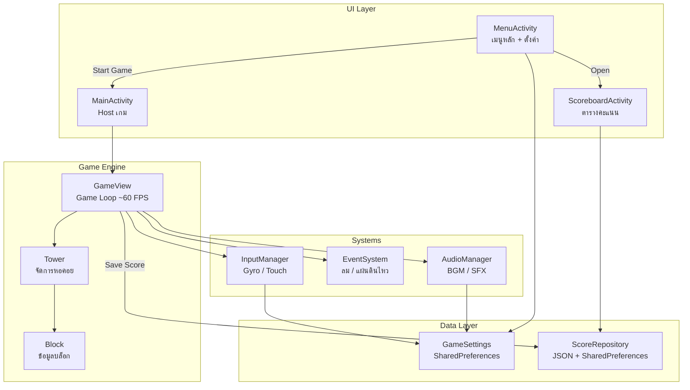

# 🏗️ Balance Tower

> เกมวางบล็อกสร้างหอคอยบน Android — ท้าทายฟิสิกส์ ทรงตัว และเอาชีวิตรอด!

**Balance Tower** เป็นเกม 2D แนว Physics-Based Stacking ที่พัฒนาด้วย **Kotlin** บน Android
ผู้เล่นต้องวางบล็อกที่ร่วงลงมาให้ซ้อนกันเป็นหอคอยให้สูงที่สุด โดยต้องรักษาสมดุล
ท่ามกลางเหตุการณ์สุ่มอย่าง **ลม** และ **แผ่นดินไหว** ที่จะรบกวนตลอดเวลา

---

## 📖 บทนำและฟีเจอร์หลัก

### 🎮 แนวคิดของเกม

ผู้เล่นจะได้บล็อกที่มีรูปร่างและขนาดแตกต่างกันร่วงลงมาจากด้านบนของหน้าจอ
ต้องบังคับบล็อกด้วย **การเอียงอุปกรณ์ (Gyroscope)** หรือ **แตะหน้าจอ (Touch)**
เพื่อวางให้ตรงกับหอคอยด้านล่าง หากวางเฉไปมากเกินไป หอคอยจะ **ถล่มลงมา** พร้อม Animation สมจริง!

### ⭐ ฟีเจอร์หลัก

| ฟีเจอร์ | รายละเอียด |
|---------|-----------|
| **🧱 บล็อกหลากหลายรูปร่าง** | มี 12 รูปแบบ ตั้งแต่บล็อกกว้าง, แคบ, สูง, เตี้ย — แต่ละแบบมีความยากต่างกัน |
| **🎛️ ระบบควบคุม 2 โหมด** | Gyroscope (เอียงเครื่อง) และ Touch (แตะปุ่มซ้าย-ขวา หรือลาก) — สลับได้ตลอด |
| **💨 ระบบเหตุการณ์สุ่ม** | **ลม** พัดบล็อกไปทางซ้ายหรือขวา, **แผ่นดินไหว** เขย่าหอคอยทั้งหมด + สั่นเครื่อง (Vibration) |
| **💥 Tower Collapse Animation** | เมื่อหอคอยเสียสมดุล บล็อกจะถล่มลงมาพร้อม Physics จำลอง (แรงโน้มถ่วง + หมุน) ก่อนแสดง Game Over |
| **🔊 ระบบเสียง** | เพลงพื้นหลัง (BGM) + เอฟเฟกต์เสียง (SFX) สำหรับวางบล็อก, ถล่ม, และ Game Over |
| **⚙️ เมนูตั้งค่า** | ปรับระดับเสียง BGM, SFX, และความไวของ Gyroscope ได้ผ่าน Slider |
| **🏆 Scoreboard** | ระบบบันทึกคะแนน Top 20 พร้อมเหรียญ 🥇🥈🥉 สำหรับ 3 อันดับแรก — คะแนนถูกบันทึกอัตโนมัติ |
| **📸 กล้องตามหอคอย** | กล้องเลื่อนขึ้นอัตโนมัติตามความสูงของหอคอยอย่างลื่นไหล |
| **🌌 กราฟิกสวยงาม** | พื้นหลังท้องฟ้าไล่สี, ดาวกระพริบ, บล็อกเรืองแสง, ปุ่ม Gradient — วาดด้วย Canvas ทั้งหมด |

---

## 📁 โครงสร้างของโปรเจค

```
Project/
├── app/
│   ├── src/main/
│   │   ├── AndroidManifest.xml          # ลงทะเบียน Activity และ Permission
│   │   ├── java/com/example/balance/
│   │   │   ├── MainActivity.kt          # Activity หลักของเกม (host GameView)
│   │   │   ├── MenuActivity.kt          # หน้าเมนูหลัก + หน้าตั้งค่า (Canvas UI)
│   │   │   ├── ScoreboardActivity.kt    # หน้า Scoreboard แสดง Top 20 (Canvas UI)
│   │   │   ├── GameView.kt              # 🎮 SurfaceView หลัก — Game Loop, Physics, Rendering
│   │   │   ├── Block.kt                 # Data class ของบล็อก (ตำแหน่ง, ความเร็ว, ขนาด, สี)
│   │   │   ├── Tower.kt                 # จัดการหอคอย (Collision, Balance Check, Collapse)
│   │   │   ├── EventSystem.kt           # ระบบเหตุการณ์สุ่ม (ลม, แผ่นดินไหว, Vibration)
│   │   │   ├── InputManager.kt          # จัดการ Input (Gyroscope + Touch Fallback)
│   │   │   ├── AudioManager.kt          # จัดการเสียง BGM (MediaPlayer) + SFX (SoundPool)
│   │   │   ├── GameSettings.kt          # บันทึกการตั้งค่าผู้เล่น (SharedPreferences)
│   │   │   └── ScoreRepository.kt       # บันทึกคะแนน Top 20 (SharedPreferences + JSON)
│   │   └── res/
│   │       ├── raw/                     # ไฟล์เสียง
│   │       │   ├── bgm_game.mp3         #   เพลงพื้นหลัง
│   │       │   ├── sfx_land.mp3         #   เสียงวางบล็อก
│   │       │   ├── sfx_topple.mp3       #   เสียงหอคอยถล่ม
│   │       │   └── sfx_gameover.mp3     #   เสียง Game Over
│   │       ├── values/                  # ค่าคงที่ (สี, ธีม, ชื่อแอป)
│   │       └── drawable/                # ไอคอนแอป
│   └── build.gradle.kts                 # Gradle build configuration
├── build.gradle.kts                     # Root Gradle config
├── settings.gradle.kts                  # Gradle settings
└── README.md                            # เอกสารนี้
```

### 📐 สถาปัตยกรรมของระบบ



### 🔄 Game Loop (ทำงานที่ ~60 FPS)

```
┌─────────────────────────────────────────────────────┐
│  1. อ่าน Input (Gyro tilt หรือ Touch drag)          │
│  2. ใส่แรงโน้มถ่วง → เพิ่มความเร็วตกของบล็อก        │
│  3. ใส่ผลกระทบจากเหตุการณ์ (ลม / แผ่นดินไหว)         │
│  4. อัพเดตตำแหน่งบล็อกที่ร่วง                        │
│  5. ตรวจสอบ Collision (บล็อก vs หอคอย / พื้น)        │
│  6. ตรวจสอบ Balance → ถ้าไม่สมดุล → Collapse          │
│  7. ตรวจสอบ Game Over (ตกจอ / พลาดหอคอย)             │
│  8. อัพเดตกล้อง (ตามหอคอยขึ้น)                       │
│  9. วาดทุกอย่างลง Canvas                             │
│ 10. Sleep เพื่อรักษา Frame Rate                       │
└─────────────────────────────────────────────────────┘
```

---

## 🛠️ เทคโนโลยีที่ใช้ (Tech Stack)

### ภาษาและแพลตฟอร์ม

| เทคโนโลยี | รายละเอียด |
|-----------|-----------|
| **Kotlin** | ภาษาหลักในการพัฒนา |
| **Android SDK** | Target SDK 36 / Min SDK 26 (Android 8.0+) |
| **Gradle (Kotlin DSL)** | ระบบ Build — ใช้ Version Catalog (`libs.versions.toml`) |

### Android APIs ที่ใช้

| API | การใช้งาน |
|-----|----------|
| **SurfaceView + SurfaceHolder** | พื้นผิวสำหรับ Game Loop แยก Thread — วาดด้วย `Canvas` โดยตรง |
| **Canvas / Paint / LinearGradient** | วาดกราฟิกทั้งหมด (บล็อก, พื้นหลัง, UI, ปุ่ม) ไม่ใช้ XML Layout |
| **SensorManager (TYPE_ACCELEROMETER)** | อ่านค่าความเอียงของอุปกรณ์สำหรับควบคุมบล็อก |
| **MediaPlayer** | เล่นเพลงพื้นหลัง (BGM) แบบ loop |
| **SoundPool** | เล่นเอฟเฟกต์เสียง (SFX) หลายเสียงพร้อมกัน |
| **Vibrator / VibrationEffect** | สั่นอุปกรณ์เมื่อเกิดแผ่นดินไหว (รองรับ API 26-36) |
| **SharedPreferences** | บันทึกการตั้งค่า (เสียง, ความไว) และคะแนน (JSON) |

### ไลบรารีที่ใช้

| ไลบรารี | เวอร์ชัน | การใช้งาน |
|---------|---------|----------|
| `androidx.core:core-ktx` | ล่าสุด | Kotlin Extensions สำหรับ Android Core |
| `androidx.lifecycle:lifecycle-runtime-ktx` | ล่าสุด | จัดการ Lifecycle ของ Activity |

> **หมายเหตุ:** โปรเจคนี้ **ไม่ใช้ Game Engine ภายนอก** เช่น Unity หรือ LibGDX
> ทุกอย่างสร้างด้วย Android Canvas API ดั้งเดิม ทำให้ APK มีขนาดเล็กและเบา

---

## 🚀 การเริ่มต้นใช้งาน

### ข้อกำหนดเบื้องต้น

- **Android Studio** Ladybug (2024.2.1) หรือใหม่กว่า
- **JDK 11** ขึ้นไป
- **Android SDK** API Level 36
- อุปกรณ์จริงหรือ Emulator ที่รัน **Android 8.0 (API 26)** ขึ้นไป

### ขั้นตอนการติดตั้ง

```bash
# 1. Clone โปรเจค
git clone <repository-url>
cd Project

# 2. เปิดด้วย Android Studio
#    File → Open → เลือกโฟลเดอร์ Project

# 3. Sync Gradle
#    Android Studio จะ Sync อัตโนมัติ หรือกด "Sync Now"

# 4. Build โปรเจค
./gradlew assembleDebug

# 5. ติดตั้งบนอุปกรณ์/Emulator
./gradlew installDebug
```

### การรันบน Emulator

1. สร้าง AVD (Android Virtual Device) ที่มี API ≥ 26
2. รันจาก Android Studio โดยกดปุ่ม **▶ Run**
3. เกมจะเปิดหน้าเมนูหลักอัตโนมัติ

> **💡 Tips:**
> - บน Emulator ไม่มี Gyroscope — ระบบจะสลับเป็นโหมด Touch อัตโนมัติ
> - บนอุปกรณ์จริง สามารถเอียงเครื่องเพื่อบังคับบล็อกได้เลย
> - กดปุ่ม **GYRO/TOUCH** มุมขวาบนเพื่อสลับโหมด

### วิธีเล่น

1. **เริ่มเกม** — กดปุ่ม `▶ START GAME` ที่หน้าเมนู
2. **บังคับบล็อก** — เอียงเครื่อง (Gyro) หรือแตะปุ่มซ้าย-ขวา (Touch)
3. **ซ้อนบล็อก** — วางให้ตรงกับหอคอย! ยิ่งตรงกลาง ยิ่งมั่นคง
4. **ระวังเหตุการณ์** — ลม 💨 จะพัดบล็อก, แผ่นดินไหว 🌍 จะเขย่าหอคอย
5. **Game Over** — หอคอยถล่ม, บล็อกตกจอ, หรือพลาดหอคอย → คะแนนถูกบันทึกอัตโนมัติ
6. **Scoreboard** — กดปุ่ม `🏆 SCOREBOARD` เพื่อดูอันดับคะแนน Top 20

---

## 🧪 Unit Tests

โปรเจคนี้มี Unit Test ครอบคลุม Logic หลักของเกม ทั้งหมด **56 test cases** ใน 3 test suites
ทดสอบด้วย **JUnit 4** บน JVM (ไม่ต้องใช้ Emulator)

### การรัน Unit Test

```bash
./gradlew testDebugUnitTest
```

### สรุปผลการทดสอบ

| Test Suite | จำนวน Tests | ผ่าน | ล้มเหลว | เวลา |
|---|---|---|---|---|
| `BlockTest` | 19 | ✅ 19 | 0 | 0.005s |
| `TowerTest` | 27 | ✅ 27 | 0 | 0.008s |
| `ScoreEntryTest` | 9 | ✅ 9 | 0 | 0.009s |
| **รวม** | **56** | **✅ 56** | **0** | — |

---

### 🧱 BlockTest — ทดสอบ Block Data Class

> ไฟล์: `app/src/test/java/com/example/balance/BlockTest.kt`

#### Computed Properties (ค่าที่คำนวณจากตำแหน่งและขนาด)

| # | Test Case | สิ่งที่ทดสอบ | ผลที่คาดหวัง |
|---|-----------|-------------|-------------|
| 1 | `centerX_isHalfWidth` | `centerX` ของบล็อกที่ x=100, w=200 | = 200.0 |
| 2 | `centerY_isHalfHeight` | `centerY` ของบล็อกที่ y=50, h=40 | = 70.0 |
| 3 | `bottom_isYPlusHeight` | `bottom` ของบล็อกที่ y=100, h=50 | = 150.0 |
| 4 | `right_isXPlusWidth` | `right` ของบล็อกที่ x=30, w=180 | = 210.0 |
| 5 | `computedProperties_atOrigin` | ทุก property ที่จุดกำเนิด (0,0) ขนาด 100×100 | center=(50,50), bottom=100, right=100 |

#### Default Values (ค่าเริ่มต้น)

| # | Test Case | สิ่งที่ทดสอบ | ผลที่คาดหวัง |
|---|-----------|-------------|-------------|
| 6 | `defaults_velocityIsZero` | ความเร็วเริ่มต้น (vx, vy) | = 0.0 |
| 7 | `defaults_notSettled` | สถานะ settled เริ่มต้น | = false |
| 8 | `defaults_rotationIsZero` | การหมุนเริ่มต้น (rotation, angularVelocity) | = 0.0 |

#### Mutation (การเปลี่ยนแปลงค่า)

| # | Test Case | สิ่งที่ทดสอบ | ผลที่คาดหวัง |
|---|-----------|-------------|-------------|
| 9 | `positionCanBeMutated` | เปลี่ยนตำแหน่ง x, y | ค่าเปลี่ยนตามที่กำหนด |
| 10 | `velocityCanBeMutated` | เปลี่ยนความเร็ว vx, vy | ค่าเปลี่ยนตามที่กำหนด |
| 11 | `settledCanBeSet` | เปลี่ยน settled จาก false → true | = true |
| 12 | `rotationCanBeMutated` | เปลี่ยน rotation และ angularVelocity | ค่าเปลี่ยนตามที่กำหนด |
| 13 | `simulateOneFrameOfMovement` | จำลองการเคลื่อนที่ 1 เฟรม (x+=vx, y+=vy) | ตำแหน่งเปลี่ยนตามความเร็ว |

#### Data Class Behavior (พฤติกรรม data class)

| # | Test Case | สิ่งที่ทดสอบ | ผลที่คาดหวัง |
|---|-----------|-------------|-------------|
| 14 | `equality_sameProperties` | 2 บล็อกค่าเหมือนกัน | assertEquals ผ่าน |
| 15 | `equality_differentPosition` | 2 บล็อกตำแหน่งต่างกัน | assertNotEquals ผ่าน |
| 16 | `copy_createsIndependentInstance` | copy() แล้วแก้ค่า | ต้นฉบับไม่เปลี่ยน |

#### Edge Cases (กรณีพิเศษ)

| # | Test Case | สิ่งที่ทดสอบ | ผลที่คาดหวัง |
|---|-----------|-------------|-------------|
| 17 | `negativePosition_computedPropertiesStillWork` | บล็อกที่ตำแหน่งเป็นลบ | คำนวณถูกต้อง |
| 18 | `verySmallBlock` | บล็อกขนาด 1×1 | centerX = 0.5 |
| 19 | `veryLargeBlock` | บล็อกขนาด 10000×10000 | คำนวณถูกต้อง |

---

### 🏗️ TowerTest — ทดสอบ Tower Class

> ไฟล์: `app/src/test/java/com/example/balance/TowerTest.kt`

#### Score & Add Block (คะแนนและการเพิ่มบล็อก)

| # | Test Case | สิ่งที่ทดสอบ | ผลที่คาดหวัง |
|---|-----------|-------------|-------------|
| 1 | `emptyTower_scoreIsZero` | คะแนนหอคอยเปล่า | = 0 |
| 2 | `addBlock_incrementsScore` | เพิ่มบล็อก 1 ชิ้น | score = 1 |
| 3 | `addMultipleBlocks_scoreMatchesCount` | เพิ่มบล็อก 5 ชิ้น | score = 5 |
| 4 | `addBlock_setsSettledAndZerosVelocity` | บล็อกที่เพิ่มต้อง settled, velocity=0, rotation=0 | ทุกค่าถูก reset |

#### Top-Y Tracking (ติดตามจุดสูงสุด)

| # | Test Case | สิ่งที่ทดสอบ | ผลที่คาดหวัง |
|---|-----------|-------------|-------------|
| 5 | `emptyTower_topYIsMaxValue` | topY ของหอคอยเปล่า | = Float.MAX_VALUE |
| 6 | `multipleBlocks_topYIsSmallest` | topY เมื่อมีหลายบล็อก | = ค่า Y ที่น้อยที่สุด (สูงสุด) |

#### Collision Detection (การตรวจจับการชน)

| # | Test Case | สิ่งที่ทดสอบ | ผลที่คาดหวัง |
|---|-----------|-------------|-------------|
| 7 | `collision_emptyTower_returnsNull` | ชนกับหอคอยเปล่า | = null |
| 8 | `collision_landsOnTowerBlock` | บล็อกร่วงลงมาถึงยอดหอคอย | ≠ null (ชนสำเร็จ) |
| 9 | `collision_noXOverlap_returnsNull` | บล็อกไม่ทับกันในแนวนอน | = null |
| 10 | `collision_aboveTower_returnsNull` | บล็อกยังอยู่เหนือหอคอย | = null |
| 11 | `collision_belowTower_returnsNull` | บล็อกผ่านหอคอยไปแล้ว | = null |

#### Balance Checking (ตรวจสอบสมดุล)

| # | Test Case | สิ่งที่ทดสอบ | ผลที่คาดหวัง |
|---|-----------|-------------|-------------|
| 12 | `isBalanced_emptyOrSingle_returnsTrue` | หอคอยเปล่าหรือ 1 ชิ้น | = true |
| 13 | `isBalanced_aligned_returnsTrue` | บล็อกตรงกันพอดี | = true |
| 14 | `isBalanced_extremeOverhang_returnsFalse` | บล็อกเยื้องมาก (x=500) | = false |
| 15 | `isBalanced_customTolerance` | tolerance=10 → false, tolerance=25 → true | ขึ้นกับค่า tolerance |

#### Break-Point Detection (ตรวจหาจุดหัก)

| # | Test Case | สิ่งที่ทดสอบ | ผลที่คาดหวัง |
|---|-----------|-------------|-------------|
| 16 | `findBreakPoint_balanced_returnsNegativeOne` | หอคอยสมดุล | = -1 |
| 17 | `findBreakPoint_unbalanced_returnsPositive` | หอคอยไม่สมดุล | > 0 |

#### Collapse Animation (แอนิเมชันถล่ม)

| # | Test Case | สิ่งที่ทดสอบ | ผลที่คาดหวัง |
|---|-----------|-------------|-------------|
| 18 | `startCollapse_movesBlocksToCollapsingList` | เริ่มถล่ม → ย้ายบล็อก | collapsingBlocks ไม่ว่าง, isCollapsing=true |
| 19 | `startCollapse_collapsingBlocksHavePhysics` | บล็อกที่ถล่มมี velocity | settled=false, มีความเร็ว |
| 20 | `startCollapse_balancedTower_doesNothing` | เรียก collapse กับหอคอยสมดุล | isCollapsing=false |
| 21 | `updateCollapse_notCollapsing_returnsFalse` | อัพเดตตอนไม่ถล่ม | = false |
| 22 | `updateCollapse_appliesGravityAndPosition` | แรงโน้มถ่วงถูกใส่ | vy เพิ่มขึ้นตาม gravity |
| 23 | `updateCollapse_removesOffScreenBlocks` | บล็อกตกจอถูกลบ | collapsingBlocks ว่าง |

#### Earthquake Offset (แผ่นดินไหว)

| # | Test Case | สิ่งที่ทดสอบ | ผลที่คาดหวัง |
|---|-----------|-------------|-------------|
| 24 | `applyOffset_shiftsAllBlocks` | เลื่อนทุกบล็อก +5px | x ของทุกบล็อก = 105 |
| 25 | `applyOffset_negativeShift` | เลื่อนทุกบล็อก -10px | x = 90 |

#### Clear / Reset (รีเซ็ต)

| # | Test Case | สิ่งที่ทดสอบ | ผลที่คาดหวัง |
|---|-----------|-------------|-------------|
| 26 | `clear_resetsEverything` | ล้างหอคอยทั้งหมด | score=0, blocks ว่าง, isCollapsing=false |
| 27 | `clear_canAddBlocksAfterReset` | เพิ่มบล็อกหลัง clear | score=1 (ทำงานปกติ) |

---

### 🏆 ScoreEntryTest — ทดสอบ ScoreEntry Data Class

> ไฟล์: `app/src/test/java/com/example/balance/ScoreEntryTest.kt`

| # | Test Case | สิ่งที่ทดสอบ | ผลที่คาดหวัง |
|---|-----------|-------------|-------------|
| 1 | `construction_storesAllFields` | สร้าง ScoreEntry ด้วยค่าต่าง ๆ | ค่าถูกเก็บครบถ้วน |
| 2 | `equality_sameValues_areEqual` | 2 entry ค่าเหมือนกัน | assertEquals ผ่าน |
| 3 | `equality_differentScore_notEqual` | คะแนนต่างกัน | assertNotEquals ผ่าน |
| 4 | `equality_differentName_notEqual` | ชื่อต่างกัน | assertNotEquals ผ่าน |
| 5 | `sortByScoreDescending` | เรียงตามคะแนนมากไปน้อย | [20, 10, 5] |
| 6 | `sortByScoreThenTimestamp` | คะแนนเท่ากัน → เรียงตามเวลาใหม่สุดก่อน | [B(300), C(200), A(100)] |
| 7 | `copy_createsIndependentInstance` | copy() แล้วแก้ค่า | ต้นฉบับไม่เปลี่ยน |
| 8 | `zeroScore_isValid` | คะแนน 0 สร้างได้ | score = 0 |
| 9 | `emptyName_isValid` | ชื่อว่างสร้างได้ | playerName = "" |

---

## 📄 License

- โปรเจคนี้จัดทำขึ้นเพื่อการศึกษาในรายวิชา CP213/509
- ผู้พัฒนา : kowit1
- GitHub: kowit1
